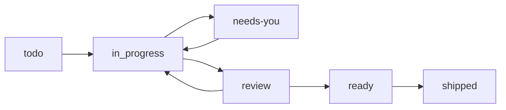

# Task Lifecycle & Workflow

This document details the complete task lifecycle for agents working with the Command Center.

## Task Creation Rules

- **Create a task for every user request** (even quick lookups)
- **Granularity**: 2+ steps or >10 minutes → main task + subtasks
- **Batching**: Multiple tiny asks (<5 min each) → one task with checklist

## Beads CLI Commands

### Creating Tasks
```bash
# Create with priority (0=urgent, 3=low)
bd create "Task title" -p 1

# Create with description
bd create "Task title" -p 1 -d "Detailed description"

# Quick create (defaults to priority 2)
bd q "Quick task"
```

### Updating Tasks
```bash
# Update status
bd update <id> --status in_progress
bd update <id> --status needs_jordan
bd update <id> --status in_review
bd update <id> --status ready_to_commit

# Update other fields
bd update <id> --title "New title"
bd update <id> --priority 0
bd update <id> --assignee "agent-name"

# Add notes
bd update <id> --notes "Progress update..."
```

### Closing Tasks
```bash
bd close <id>
```

### Viewing Tasks
```bash
# List all open
bd list

# JSON output (for scripting)
bd list --json

# Show single task
bd show <id>

# Ready tasks (no blockers)
bd ready
```

## Status Transition Flow



### Agent Transitions
- `todo` → `in_progress`: Start working
- `in_progress` → `needs-you`: Blocked on human
- `needs-you` → `in_progress`: Human answered, resume
- `in_progress` → `review`: Submit for review

### Human Transitions
- `review` → `ready`: Approved
- `review` → `in_progress`: Changes requested
- `ready` → `shipped`: Merged/deployed

## Syncing to Production

```bash
# Sync all beads to KV
npm run bd:sync

# Or directly
npx tsx scripts/sync-beads-to-kv.ts
```

### When to Sync
- After creating a task you want visible on production
- After status changes you want reflected on dashboard
- Before requesting human review (so they see updated status)

### Sync Behavior
1. Fetches all non-closed issues from beads
2. Maps beads status → frontend status
3. Writes to Vercel KV (Upstash)
4. Removes closed tasks from KV

## Task Templates (for descriptions)

### Bug Fix
```
**Problem**: What's broken
**Root Cause**: Why it broke
**Fix**: What we changed
**Tests**: How we verified
**Risk**: Potential side effects
```

### Feature
```
**Goal**: What we're building
**Scope**: What's included/excluded
**Milestones**: Key checkpoints
**Acceptance**: How to verify success
```

### Refactor
```
**Why**: Motivation for change
**Impacted Areas**: What files/modules
**Steps**: Migration plan
**Safeguards**: How to rollback
```

### Research
```
**Question**: What we need to answer
**Sources**: Where we looked
**Findings**: What we learned
**Recommendation**: Suggested action
```
